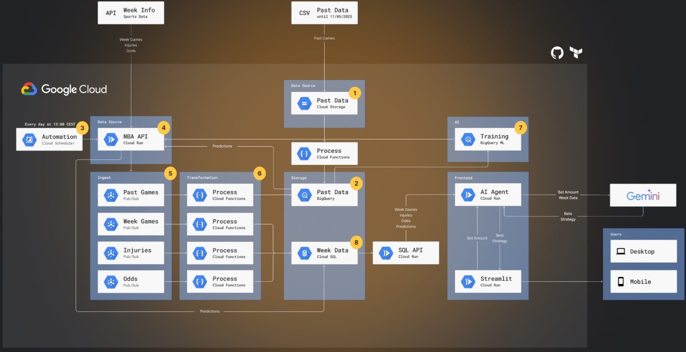
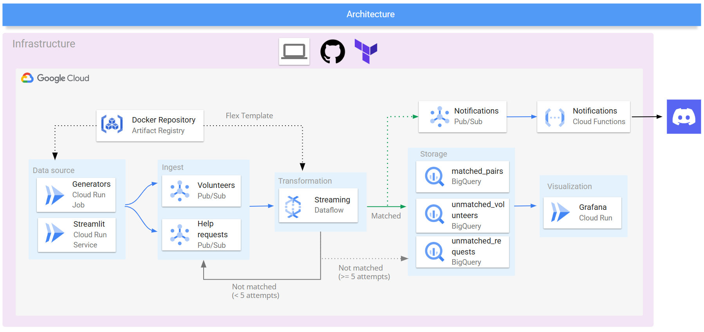
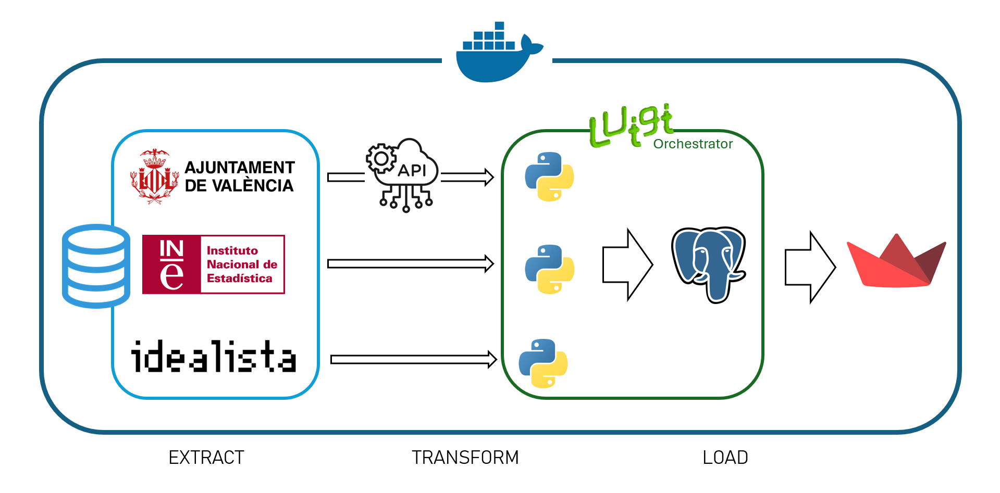

# Data Projects
**Data Projects** served as training tools with the objective of challenge students to face real scenarios in a collaborative environment.
In these sessions, a business case was presented, to which, by teams, we had to come up with the best technical and business solution.
 
 
Data Projects were evaluated on two main aspects: 
1. **Business**: originality, presentation, business feasibility and adequacy to the requirements
2. **Technology**: Architecture design, suitability of the pieces, technical implementation and justification of the decisions.

## Data Project 3 (integrating AI)

### 🔍 Challenge
We were asked to design a chatbot powered by APIs and any additional tools of our choice. It was an open challenge focused on creativity, integration, and real-world application.

### 🎯 Project Objective
Our goal was to build **BetMaestro**, a smart assistant that helps users make informed decisions when betting on NBA games. The chatbot leverages real-time data and predictive models to deliver insights and recommendations.

### 📄 Project Description
BetMaestro is a fully integrated, end-to-end data and AI solution. It gathers and processes data from multiple sports-related APIs, runs predictive models, and serves insights through a conversational interface.

Key highlights of the project:

- Backend: Built with Flask APIs for real-time data ingestion and AI-driven predictions

- Cloud Infrastructure: Deployed on Google Cloud Platform using services like Pub/Sub, BigQuery, and Cloud SQL – all managed via Terraform

- Data Sources: Integrated external APIs such as SportsData.io and TheOddsAPI to feed the system with up-to-date NBA data (games, odds, injuries)

- AI/ML: Custom models and agent-based logic to analyze patterns and support decision-making

With BetMaestro, we aimed to turn complex sports data into actionable insights and deliver an intuitive user experience that connects data, AI, and real-life use cases.

The project includes a **cloud-based** architecture built with **Google Cloud Platform (GCP)** and managed fully using **Terraform** for IaC.  Key services can be seen in the **architecture** below:

 

### 🔗 See More
To see the full project and code, access the [repository here](https://github.com/e-wach/Data-IA-Project-3)!

## Data Project 2 (cloud)

### 🔍 Challenge
_We need to design a voluntary aid platform for the DANA. The idea is to build a platform to help in real time to people's needs in case of catastrophe. This platform would be sent on the warning notice in the area._

### 🎯 Project Objective
In this second project, the aim was to present a solution designed to connect people affected by a catastrophe with local volunteers. The platform enables users to request help or offer support, fostering mutual aid within the community. Our goals were to encourage active participation and volunteering, strengthen local engagement, and ensure a scalable and user-friendly experience that can adapt to urgent needs in real time.

### 📄 Project Description
It is a **real-time** aid coordination platform designed to respond to natural disasters. The system allows affected individuals to request help and local volunteers to offer support through a simple and scalable interface.
 
The project includes a **cloud-based** architecture built with **Google Cloud Platform (GCP)** and managed fully using **Terraform** for IaC.  Key services can be seen in the **architecture** below:

 

### 🔗 See More
To see the full project and code, access the [repository here](https://github.com/joel1091/Data-Project-02)!

## Data Project 1 (on-premise)
### 🔍 Challenge
_Due to the recent incidents (i.e., DANA), Valencia's city council is forecasting a rise in housing prices, but how do we know where they are going to rise the most? Can we predict where people will want to live in the future?_

### 🎯 Project Objective
The project's objective was to create an interactive platform with dynamic maps that integrates key data (such as essential services, green areas, pulbic transport and market places), allowing the user to compare areas accoridng to quality of life. The aim was to help them make informed housing decisions.

### 📄 Project Description
This project was developed as an **on-premise**, **fully dockerized** solution to support informed housing decisions through data-driven insights. We extracted and processed various datasets using Python, storing the cleaned data in a PostgreSQL database.
 
To present the information in a user-friendly way, we built an interactive Streamlit application that visualizes dynamic maps and key indicators directly from the database.

 

### 🔗 See More
To see the full project and code, access the [repository here](https://github.com/Marcanta7/DATAPROJECT1)!

