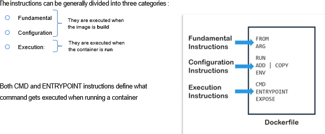

# Docker

```docker
docker images *=> listar todas las imágenes*
docker image ls
```

```docker
docker ps *=> listar todos los contenedores en marcha*
docker ps -a *=> listar todos los contenedores*
```

```docker
docker run [imagen] *=> crea un contenedor (sin interacción)*
docker run -it [imagen] *=> crea un contenedor y ejecuta el contenedor*

docker run -d [imagen] *=> dettach, para liberar la terminal y eliminar la dependencia del contenedor*
```

```docker
docker start [contenedor] *=> inicia el contenedor*
docker exec -it [contenedor] /bin/bash *=> ejecuta el contenedor existente y te mete dentro*

docker stop [contenedor]

docker start -i [contenedor] *=> inicia el contenedor y permite interactu*
```

**-it:** sesión interactiva para que el contenedor funcione. Si no se inicia, el contenedor “no sirve” para usarlo.

No es necesario en todos los contenedores (por ejemplo, jupyter ⇒ servicio al que se accede desde docker).

**start:** si se inicia manualmente, se tiene que parar de la misma manera.

Con -it se inicia y cierra “automáticamente”.

```docker
docker rm [contenedor] *=> borrar contenedores*
docker rmi **[imagen] *=> eliminar imágenes*
docker rmi --force **[imagen] *=> fuerza la eliminación de una imagénes (no deja borrar si hay contenedores)*
```

```docker
docker run -p [puerto] [imagen] 
docker run -p [puerto tuyo:puerto] [imagen] 
docker run -p 8888:8888 [imagen] 
```

```docker
docker run [imagen] [comando] *=> docker run ubuntu ls => te lista el contenedor sin necesidad de entrar*
```

```docker
docker logs [contenedor] *=> en logs se guarda todo lo que se ha hecho en un contenedor*
docker tops [contenedor] *=> muestra los procesos en ejecución en el contenedor*
docker stats [contenedor] *=> uso en tiempo real de los recursos (CPU, memoria, etc.) de uno de los contenedores*
docker system prune *=> elimina todos los datos no utilizados (contenedores detenidos, imágenes sin referencias, chaché, etc.)
										=> contenedores parados, dangling images, cache*
```

```docker
docker commit [contenedor] [imagen] *=> crear una nueva imagen a partir de cambios realizados en un contenedor en ejecución*
```

**Variables de entorno**

```docker
docker build -e [variable de entorno]
docker run -e [variable de entorno] [imagen] *⇒ crea la variable*

docker run -e RARA=”hola” env_test
```

## Volumen

Un volumen es una forma de almacenar datos que puede ser compartida entre contenedores y que persiste cuando los contenedores se eliminan. 

```powershell
** docker run -it -v [nombre volumen] [imagen] *=> crea un volumen ANÓNIMO*
docker run -it -v [carpeta out:/carpeta in container] [imagen] *=> crear volumen NO anónimo
	docker run -it -v mi_carpeta:/my_folder ubuntu => mi_carpeta (nombre del volumen); my_folder (carpeta en contenedor)
	docker run -it -v [ruta de tus carpetas c:\...]:/my_folder ubuntu => crear directamente en tu directorio*

docker run -p 8888:8888 -v [carpeta out:/carpeta in container] [imagen]
```

```powershell
docker volume ls
```

Para ejecutar un volumen existente, se tiene que levantar un contenedor en caso de que se haya borrado el anterior.

## DockerFile

**Docker file:** archivo de texto que contiene una serie de instrucciones para construir una imagen Docker. Define los pasos necesarios para configurar el entorno y ejecutar una aplicación dentro de un contenedor.

Si modificas el DockerFile, tienes que crear una nueva imagen

```docker
# Usa la imagen base de Ubuntu 20.04
FROM ubuntu:20.04

# Establece el directorio de trabajo en /app
WORKDIR /app

# Actualiza la lista de paquetes e instala Python 3
RUN apt-get update && apt-get install -y python3 && apt-get clean

# Copia el archivo hello.py al directorio de trabajo en el contenedor
COPY hello.py /app

# Especifica el comando para ejecutar el script de Python
CMD ["python3", "hello.py"]
```

- FROM ⇒ se recomienda utilizar imágenes de menor tamaño posible.
- ARG ⇒ argumentos.
- COPY ⇒ copiar archivos. Se recomienda codificar en un archivo separado y luego copiar su contenido al DockerFile. No se suele codificar en el DockerFile.
- ENV ⇒ variables de entorno.
- WORKDIR ⇒ se indica el directorio donde se va a trabajar.
- EXPOSE [puerto] ⇒ abre el servidor indicado.
- CMD ⇒ entra en el contenedor y ejecuta. Define el comando por defecto que se ejecutará cuando un contenedor se inicie
- ENTRYPOINT ~= CMD ⇒ define el comando que siempre se ejecutará cuando el contenedor se inicie. No puede ser sobrescrito, solo se pueden añadir argumentos.



```docker
FROM ubuntu:latest
## Todos los comandos van después de RUN
RUN apt-get update && apt-get install -y python3 && apt-get clean
RUN mkdir my-scripts 
RUN cd my-scripts
RUN touch app.py
RUN echo "nombre = input('¿Cómo te llamas?:')" > app.py && echo "print(f'Hola {nombre}')" >> app.py
# Ejecutar
CMD ["python3", "app.py"]
```

Otra forma de escribir RUN (crea imágenes más pequeñas):

```docker
RUN apt-get update && apt-get install -y python3 && apt-get clean\
		mkdir my-scripts\
		cd my-scripts\
		touch app.py
```

```docker
docker build -t [imagen] . *=> crea la imagen*
docker run -it [imagen] *=> crea un contenedor y lo ejecuta*

docker run [imagen] *=> te devuelve en consola lo del CMD***

docker run --rm [imagen] *=> crea un contenedor, lo ejecuta y lo borra directamente*
```

## Docker-compose

Permite definir y ejecutar aplicaciones Docker de múltiples contenedores. Se utiliza un archivo `docker-compose.yml` donde se describe la configuración de los servicios. Permite iniciar, detener y gestionar todos los contenedores con un solo comando.

Ejemplo básico:

```docker
## version: '3.5'
services:
  web:
    image: nginx
    ports:
      - "8080:80"
  db:
    image: mysql:5.7
    environment:
      MYSQL_ROOT_PASSWORD: ejemplo
```

```docker
docker-compose up -d *=> levantar el docker-compose*
docker-compose down *=> detener servicios*
docker-compose ps *=> listar servicios en ejecución*
docker-compose start *=> iniciar servicios creados que están detenidos*
docker-compose stop *=> detener sin eliminar*
docker-compose build *=> construye la imagen sin iniciar el servicio*
docker-compose exec [comando] *=> ejecuta un comando dentro de un contenedor en ejecución*
docker-compose run *=> ejecutar comandos úniocos sin afectar los contenedores en ejecución*
docker-compose pull *=> descarga las imágenes de los servicios definidos en el .yml desde un registro remoto*
```

Ejercicio client/server:

```docker
# version: '3.5'

services:
  server:
    container_name: server_container
    build: # si estuvieran en carpetas diferentes, añadir el nombre de la carpeta .nombrecarpeta
      dockerfile: dockerfile.server
    volumes:
      - data:/data
    ports:
      - "8000:8000"
    networks:
      - my_net

  client:
    container_name: client_container
    build: 
      dockerfile: dockerfile.client
    tty: true # arrancar un bash
    networks:
      - my_net

networks:
  my_net:

volumes:
  data:
```

