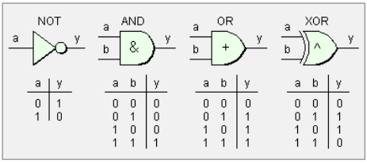

# Python

## Variables

```python
A = 'B' *=> creación de una variable
## Ejemplo*
nombre = 'Ting'
print(nombre)
nombre = 'Martín' *=> en esta línea, nombre sigue siendo Ting.*
# en esta línea, nombre es Martín

nombre = 'Ting'
apellido = 'Wang'
print(nombre,apellido) *=> Ting Wang*
print(nombre,'-',apellido) *=> Ting - Wang*
```

**Indicar el tipo de variable** nos vale a nosotros, para la máquina no hace diferencia.

```python

n:str = 'Eric' *=> str indica que el tipo de variable es texto (string = texto)*
print(n + 1) *=> python diferencia entre texto y números. Si sumas texto y número, da error.*
print(n + ' Wang') *=> Eric Wang*

**n = 9.0
print(n) *=> da 9.0*
print(n +1) *=> da 10*

'''
:int => números enteros 
:float => números con decimales
'''
a:int = 1
b:int = 2.5
c:float = 1
d:float = 2.5

# Boolean = valores binarios
variable:bool = True
variable2:bool = False
```

## Operadores

### Operadores numéricos

- Suma +
- Resta -
- Multiplicación *
- Exponente **

- División /
- División entera //
- Módulo (resto) %

**Orden de las operaciones:**

1. Paréntesis
2. Exponente
3. Multiplicación
4. Suma
5. Sustracción

### Operadores de texto

- Concatenación +
- Repetición *
    
    ```python
    nombre: str = "Martín"
    apellidos: str = "San José de Vicente"
      
    # Concatenación
    nombre_completo: str = nombre + " " + apellidos
    print(f"> Nombre completo: {nombre_completo}")
      
    # Repetición
    nombre_x5: str = nombre*5
    print(f"> Nombre 5 veces: {nombre_x5}")
    ```
    

### Operadores de Comparación

- Igualdad (is) ==
- Distinción (is not) !=
- Mayor/menor que > // <
- mayor o igual/menor o igual >= // <=

```python
c: int = 3
d: int = 3
e: int = 4
# Igualdad - Nos devolverá True o False
print(f"> ¿3 y 3 son iguales? {c is d}") # Operador Identidad
print(f"> ¿3 y 3 son iguales? {c == d}")
print(f"> ¿3 y 4 son iguales? {c is e}") # Operador Identidad

# Desigualdad - Nos devolverá True o False
print(f"> ¿3 y 3 no son iguales? {c is not d}") # Operador Identidad
print(f"> ¿3 y 4 no son iguales? {c is not e}") # Operador Identidad
print(f"> ¿3 y 3 no son iguales? {c != d}")

# Mayor Qué / Mayor o Igual qué
print(f"¿3 mayor que 2? {3 > 2}")
print(f"¿2 mayor que 3? {2 > 3}")
print(f"¿3 mayor o igual que 3? {3 >= 3}")

# Menor Qué / Menor o Igual qué
print(f"> ¿2 menor que 3? {2 < 3}")
print(f"> ¿3 menor que 2? {3 < 2}")
print(f"> ¿3 menor o igual que 3? {3 <= 2}")
```

### Operadores lógicos

- False = 0 = None
- True = 1
- and
- or
- not

```python
# And (y)
print(f"> Verdadero y Verdadero = {True and True}")
print(f"> Verdadero y Falso = {True and False}") #False
print(f"> Verdadero y 1 = {True and 1}")
print(f"> Falso y Falso = {False and False}") #False
print(f"> Falso y 0 = {False and 0}") #False
print(f"> Falso y None = {False and None}") #False

# Or (ó)
print(f"> Verdadero o Verdadero = {True or True}")
print(f"> Verdadero o Falso = {True or False}")
print(f"> Verdadero o Falso = {False or True}") #True
print(f"> Falso o False = {False or False}")

# Not ( Lo contrario )
print(f"> Not Verdadero = {not True}")
print(f"> Not Falso = {not False}")
print(f"> Not Falso o Verdadero = {not (False or True)}") #False => se ejecuta primero (True) y luego es not True
```

### Operadores de pertenencia

- Contiene otro: in
- No contiene otro: not in

```python
# in or not in
mi_texto:str = "Lorem ipsum dolor sit amet consectetur adipiscing elit dui odio"
mi_sub_texto: str = "amet"
mi_otro_sub_texto: str = "pepito"

print(f"> ¿amet está dentro del mi_texto?: {mi_sub_texto in mi_texto}")
print(f"> ¿pepito no está dentro de mi_texto?: {mi_otro_sub_texto not in mi_texto}")

```

### Operadores de asignación

Permiten dar un valor nuevo o modificado a una variable.

- Simple =
- Suma +
- Resta -
- Multiplicación *=

- División /=
- División entera //=
- Exponente **=
- Módulo %=

```python
##### Asignación Simple
puntos_obtenidos: int = 0
print(f"> Los puntos obtenidos actuales son: {puntos_obtenidos}") # 0
##### Asignación con suma
puntos_obtenidos = puntos_obtenidos + 1 # se reasigna el valor de la variable
print(f"> Los puntos obtenidos actuales son: {puntos_obtenidos}") # 1

puntos_obtenidos += 1 # += es lo mismo que arriba
print(f"> Has conseguido otro punto. Ahora tienes: {puntos_obtenidos}") # 2

#### Lo mismo para el resto de operaciones
# Resta
puntos_obtenidos = puntos_obtenidos - 3
print(f"> Has perdido 3 puntos. Ahora tienes: {puntos_obtenidos}")

puntos_obtenidos -= 3
print(f"> Has perdido 3 puntos. Ahora tienes: {puntos_obtenidos}")

# Módulo
puntos_obtenidos = puntos_obtenidos % 2
print(f"> Tremendo Error, tus puntos pasan a ser el resto de dividir entre 2: {puntos_obtenidos}")

puntos_obtenidos %= 2
print(f"> Tremendo Error, tus puntos pasan a ser el resto de dividir entre 2: {puntos_obtenidos}")
```

### Operadores de Bits:

Realizan cálculos que ****implican a cada bit (representado de forma binaria). Se les suele llamar puertas lógicas y son muy usados en sentencias condicionales complejas.

- NOT: not
- AND: &
- OR: |
- XOR: ^



## Formatear cadenas de texto (f)

```python
**f'TEXTO {variable},{variable2}'**

nombre = 'Ting'
apellido = 'Wang'
print(f'Hola {apellido},{nombre}') *=> Hola Wang, Ting*

saludo = f'Hola {apellido},{nombre}'
print(saludo) *=> Hola Wang, Ting*

nombre = 'Chao'
print(saludo) *=> nombre sigue siendo Ting*

nombre = 'Chao'
saludo = f'Hola {apellido},{nombre}'
print(saludo) *=> nombre cambia a Chao (se ha reescrito nombre)*
```

## Listas
```python
lista_clase = ['Ting','Chao','Eric']
print(lista_clase[1]) *=> Chao*
print(lista_clase[0:1]) *=> [Ting] = en formato lista*
print(lista_clase[0:2]) *=> [Ting, Chao] = en formato lista*
print(lista_clase[-1]) *=> Eric*
print(lista_clase[-3]) *=> Ting*
print(lista_clase[-4]) *=> ERROR*
print(lista_clase[4]) *=> ERROR*
```

**Listas (ejemplo):**

```python
#                0,  1,  2,  3,  4,  5,  6,  7
lista_letras = ['a','b','c','d','e','h','i','j']

# igual que print(lista_letras)
print(lista_letras[0:])
# a partir del 2 (c)
print(lista_letras[2:])
# hasta el 4 incluído
print(lista_letras[0:5])

# valores exactos
print(lista_letras[0])
print(lista_letras[1])
print(lista_letras[3])
# valores exactos empezando a contar por el último
print(lista_letras[-1])
print(lista_letras[-2])
print(lista_letras[-8])

# dentro de un rango
# del 0 al 7, de dos en dos (empezando por 0) = 0, 2, 4, 6
print(lista_letras[0:7:2])
# del 0 al 3, de dos en dos = 0, 2
print(lista_letras[0:3:2])
# del 2 al 6, de tres en tres = 2, 5
print(lista_letras[2:6:3])
# del 2 al 3, dos = 2 (el primero)
print(lista_letras[2:3:2])
# del 2 al 4, de 3 en tres = 2 (el primero)
print(lista_letras[2:4:3])
#del 3 al 6, de dos en dos = 3, 5
print(lista_letras[3:6:2])
```

**Lista ejercicio:**

```python
alumno_1 = 'Martin San José'
# aunque sea de 0 a 5, se pone hasta el espacio (6)
nombre = alumno_1[0:6]
print(nombre)
apellido = alumno_1[7:15]
# apellido = alumno_1[7:] => si no pones el final, va hasta el final
print(apellido)

```

**Comandos:**

```python
# lista_master está vacía
lista_master = []

lista_master.append(alumno_2) *=> añade alumno_2 al final*
lista_master.clear *=> borra el contenido de la lista*
```

**Ejercicios:**

```python
# Ejercicio 1: obtener el nombre del alumno 2 desde la variable de lista_master
print(lista_master[0]["nombre"])
# También se puede crear una variable que sea lista_master[0]['nombre'] y luego print la varaible
print(f"el numbre del alumno es:{lista_master[0]['nombre']}")

# Ejercicio 2: obtener la nota del segundo examen del alumno_3
# Para cada lista hay que indicar la posición
nota_examen_2 = lista_master[1]["cursos"][0]["examenes"][1]["nota"]
print(f"la nota en el examen es de {nota_examen_2}")
```

## Diccionarios

```python
# Definición de alumno > Diccionario

alumno_1= {
    "id": 1234,
    "nombre": "Chao",
    "apellidos": "Wang",
    "genero": "masculino",
    "aprobado": True,
    "nota_media": 8.8
}

print(f"El nombre del alumno es:{alumno_1['nombre']}")

# Diccionario complejo

alumno_2= {
    "id": 2,
    "nombre": "Ting",
    "apellidos": "Wang",
    "genero": "femenino",
    "email": "xxx@edem.es",
    "aprobado": True,
    "nota_media": 9.9,
    "cursos":[
        {
            "id": 1,
            "nombre":"Python",
            "examenes": [
                {
                    "nombre":"fundamentos",
                    "duracion": 60,
                    "nota": 10
                },
                {
                    "nombre":"pandas",
                    "duracion": 120,
                    "nota": 9
                }   
            ]
        }
    ]
}
```

## Rangos

```python
rango = range(5)
print(rango) # Salida range(0, 5)
print(list(rango))  # Salida: [0, 1, 2, 3, 4]

rango = range(1, 10, 2)  # Desde 1 hasta 9, incrementando de 2 en 2
#        start, stop, step
print(list(rango)) # Salida: [1, 3, 5, 7, 9]
```

```python
# multiplica cada valor del range por 0.5
rango_flotante = [x * 0.5 for x in range(0, 10)]  # una operación en un bucle (en un rango)
print(rango_flotante)  # Salida: [0.0, 0.5, 1.0, 1.5, ..., 4.5]

```

## Sets

Las listas se pueden convertir en sets. La diferencia entre ellas es que las listas van ordenadas, mientras que los sets no.

```python
mi_set = set()

mi_set = set([1, 2, 2, 3, 4])  # Elementos duplicados se eliminan
print(mi_set)  # Salida: {1, 2, 3, 4}

mi_set = set("abracadabra")
print(mi_set)  # Salida: las letras no se ordenan de ninguna forma (aleatoria cada vez que se ejecuta).
```

Añadir un valor a un set:

```python
mi_set = {1, 2, 3}
mi_set.add(4)
mi_set.add(2) # lo omite porque se repite
print(mi_set)  # Salida: {1, 2, 3, 4}
```

Update un set:

```python
mi_set.update([5, 6, 7])
print(mi_set)  # Salida: {1, 2, 3, 4, 5, 6, 7}
```

Eliminar items del set:

```python
mi_set = {1, 2, 3, 4}
mi_set.remove(2) # = mi_set.discard(2) 
# mi_set.remove(5) => da error
mi_set.discard(5) # no da error
print(mi_set)  # Salida: {1, 3, 4}

# Eliminar un valor. Elimina el último si no se especifica (en el caso de una cadena de texto, es aleatorio)
elemento = mi_set.pop() 
print(elemento)

mi_set = set("abracadabra") ## elimina letra aleatoria
elemento = mi_set.pop()
print(elemento)
```

Conjuntos:

```python
# unificar
set1 = {1, 2, 3}
set2 = {3, 4, 5}
union = set1 | set2  # Usando el operador | => para unir dos sets
print(union)  # Salida: {1, 2, 3, 4, 5}
# ó
union = set1.union(set2)  # Usando el método union()
print(union)  # Salida: {1, 2, 3, 4, 5}

#interseccion
interseccion = set1 & set2  # Usando el operador & => el número que se repite
print(interseccion)  # Salida: {3}
# ó
interseccion = set1.intersection(set2)  # Usando el método intersection()
print(interseccion)  # Salida: {3}

#diferencia
diferencia = set1 - set2  # Elementos en set1 que no están en set2
print(diferencia)  # Salida: {1, 2}
# ó
diferencia = set1.difference(set2)
print(diferencia)  # Salida: {1, 2}
```

Subconjuntos:

```python
set1 = {1, 2, 3}
set2 = {1, 2, 3, 4, 5} # pueden estar en diferente orden
print(set1.issubset(set2))  # Salida: True => set1 es un subset de set2 (set1 está integrado en set2)

# lo contrario, dentro de un set se contiene otro
print(set2.issuperset(set1))  # Salida: True

#disjointed = no hay ningún dato en común
set3 = {6, 7, 8}
print(set1.isdisjoint(set3))  # Salida: True
```

Inmutables:

```python
# frozenset = como las tuplas, no se pueden modificar(solo que no hay datos repetidos)
mi_frozenset = frozenset([1, 2, 3, 4])
print(mi_frozenset)  # Salida: frozenset({1, 2, 3, 4})
```

Comparaciones:

```python
set1 = {1, 2, 3}
set2 = {3, 1, 2}
print(set1 == set2)  # Salida: True (el orden no importa en los sets, en cambio si fuesen lista sería fal
```

Bucle y lista:

```python

mi_set = {1, 2, 2, 3, 4, 5, 4, 3}
for elemento in mi_set:
    print(elemento) # ordenados y sin repetir (son números)

mi_set = {1, 2, 3, 3, 5, 4, 10}
mi_lista = list(mi_set)
print(mi_lista) # ordenados y sin repetir (son números)
```

## Condicionales

Condicionales IF - EL(SE)IF - ELSE

Sirven para controlar el flujo de ejecución a partir de una condición. Ejecutar algo o no ejecutarlo dependiendo de alguna condición.

La indentación/tabulación es imprescindible ya que marca dónde empieza y donde termina la condición.

```python
if (condición):
	# ejecutar una o varias líneas
elif (otra_condición):
	# ejecutar otras sentencias
elif (otra_condición_más):
	# ejecutar otras sentencias
else:
	# ejecutar otras sentencias si no se han 
	# cumplido ningunas de las condiciones anteriores

```

Ejemplo:

```python
# Condicionales
miEdad: int = 45
if (miEdad >= 60):
    print('Apuntarse al gym') # NO
elif (miEdad < 60 and miEdad > 30): # SÍ
    print ('Adulto maduro')
elif (miEdad == 30): # YA NO SE EJECUTA PORQUE LA DE ARRIBA YA SE HA CUMPLIDO (aunque hubiera más condiciones true debajo)
    print ('Adulto en su sweet moment')
elif (miEdad < 30 and miEdad >= 18):
    print ('Adulto joven, todo en orden')
else:
    print ('¡A clase!')
```

## Bucles

Realizar una iteración hasta que se cumpla alguna condición que marquemos.

Ejemplo: Para mostrar por consola todos los números del 1 al 100 se deberá realizar un bucle que itere por cada uno de los valores de esa lista, hasta que llegue al número 100.

**FOR:** Consiste en realizar una tarea tantas veces como se indique en la condición que se establezca. La tabulación es esencial, pues todo lo que se encuentre dentro del FOR, se ejecutará tantas veces como se le indique.

Los bucles FOR tienen, por definición, ya establecido el límite de ciclos que va a realizar.

```python
# ESTRUCTURA
for elemento in lista_elementos:
	# ejecutar alguna cosa 
```

Ejemplo:

```python
## EJEMPLO: mostrar todos los elementos de una lista y encontrar si el número es par o impar (condiciones).
lista = [1,2,3,4,5,6,7,8]

for elemento in lista:
    if(elemento % 2 == 0):
        print(f'{elemento} es par')
    else:
        print(f'{elemento} es impar')
```

**WHILE**:  repiten una serie de sentencias según algún criterio. El número de iteraciones (ciclos) puede cambiar dependiendo de dos factores:

1. El valor del elemento con el que condiciona el bucle. Esto hace que  puede que no se lleguen nunca a ejecutar o incluso se puedan dar casos de bucles infinitos.
2. De las operaciones que se realicen dentro del bucle.

Se ejecuta mientras se cumpla esta condición.

```python
# ESTRUCTURA
while (condición):
	# ejecutar código
```

Ejemplo:

```python
# EJEMPLO: encontrar y eliminar elementos hasta que la longitud sea 3

while (len(lista) > 3): # len = longitud de la lista
    lista.pop() # En cada iteración elimina 1 dato hasta cumplir la condición [1,2,3]
    print(lista)
```

Uno de los mayores riesgos son los bucles infinitos. El bucle nunca llegaría a salir, ya que la condición para su ejecución nunca cambiaría.

```python
# BUCLE INFINITO
while (True):
    print(lista)     
///
suma: int = 0
while True:
    suma+=1
    print(suma)
```

**DO WHILE**: se ejecuta al menos una vez, mientras que un bucle WHILE podría no llegar a ejecutarse nunca.

```python
# Python NO CUENTA con bucles DO - WHILE, pero se pueden simular:
i = 1  
while True:  
    print(i)  
    i = i + 1  
    if(i > 5):  
        break # rompe el bucle una vez llega a 5
```

## Funciones

Las funciones son un conjunto de sentencias/instrucciones aisladas/encapsuladas que permiten la reutilización de código de una tarea específica y recurrente.
Ejemplo: *Encontrar la media de precio de una lista de elementos* ⇒ crear una función reutilizable que reciba una lista indefinida y que obtenga la media del precio y lo devuelva a quien se lo hubiera pedido.

Funciones propias:

```python
def nombreFunción (parámetros) -> tipo_retorno:
	# declaración de variables
	# y ejecución de código 
```

Ejercicio:

```python
# Ejercicio: Función para saber si un año es bisiesto
def esBisiesto(year:int) -> None:
    if (year % 4 == 0 and year % 100 != 0) or (year % 400 == 0): # == {resto}
        print(f'{year} es bisiesto')
    else :
        print(f' - {year} no es es bisiesto')

lista_year = [2020, 2021, 2022, 2023, 2024, 2025]

for year in lista_year:
    esBisiesto(year)

# Otra forma de hacerlo utilizando rangos de valores
x = range(1997,2030)
for year in x:
    esBisiesto(year)
```

- **Retorno**: tipo de retorno que vamos a devolver en una función al enviarle unos parámetros.
- **Ámbito**: espacio entre la apertura y cierre de una estructura de código. La apertura del ámbito se indica con “:” y se delimita su cierre a través de la tabulación

- **Paso de parámetros**: existen dos paso de parámetros:
    - Por VALOR: pasamos únicamente el valor al parámetro y este hará de nueva variable local dentro de la función. Si el valor del parámetro se modifica, el valor de la variable original no lo hace.
    - Por REFERENCIA: Se pasa el punto de memoria donde el valor está guardado (referencia). Si dentro de la función el valor se modifica, también se modifica el valor de la variable original, ya que ambas estarían apuntando al mismo punto de la memoria.


### Función básica:

```python
# Función Básica
def miFuncion():
  print(f"Esto es una función básica")
# Llamando y ejecutando la función
miFuncion()
```

Ejemplo:

```python
# Funciones sin parámetros
def saludar(): # los paréntesis se tienen que poner igual
    print('Hola')
saludar() # Imprime directamente el Hola

def despedirnos(nombre:str) -> str:
    despedida = f'Adios, {nombre}'
    return despedida # cada vez que se llame la función, recibimos un texto con el contenido de la variabla despedida
'''
Lo mismo que arriba
def despedirnos(nombre:str) -> str:
    return f'Adios, {nombre}'
'''    
texto_despedida = despedirnos('Martin') # el tipo_retorno es "texto_despedida" y el parámetro 'Martin'
```

### Función con parámetros no tipados:

```python
# Función con Parámetros No Tipados
def miFuncionConParametros(a,b):
    print(f"¡{a}, {b}!")
# llamando la función y pasándole algunos parámetros
miFuncionConParametros('Hola', 'Mundo')
```

### Función con parámetros tipados:

```python
# Función con Parámetros Tipados
def miFuncionConParametrosTipados(a: str, b: str) :
    print(f"¡{a}, {b}!")
# llamando la función y pasándole algunos
# parámetros tipados
miFuncionConParametrosTipados('Hola', 'Mundo')
```

### Función con parámetros tipados por defecto:

```python
# Función con parámetros por defecto
# Si un valor no viene, se pone por defecto
def miFuncionConParametrosPorDefecto(a, b = 1) :
    print(f"La división es {a/b}")
# llamando la función y pasándole los dos parámetros
miFuncionConParametrosPorDefecto(3, 4)
# llamando la función y pasándole un único parámetro
miFuncionConParametrosPorDefecto(3)
```

### Función con número indenterminado de parámetros:

```python
# Función con muchos parámetros
def miFuncionConMultiplesParametros(*elementos) :
    for elemento in elementos:
        print(f"Elemento: {elemento}")

# llamando la función y pasándole una lista de parámetros
lista: [int] = [1, 2, 3, 4, 5]
miFuncionConMultiplesParametros(lista)
```

### Función con retorno:

Devuelve un valor sin tipar que se puede almacenar en una variable.

```python
# Función con Retorno
def miFuncionConRetorno():
    return '¡Hola, Mundo!'

# llamando, ejecutando y almacenando el retorno en una variable
# la variable hola_mundo acabará valiendo "¡Hola, Mundo!"
hola_mundo = miFuncionConRetorno()
print(hola_mundo)
```

Otro ejemplo más de una función con que devuelve un valor tipado que podemos almacenar en una variable:

```python
# Función con Retorno Tipado
def miFuncionConRetornoTipado(*elementos) -> int :
    # Inicializamos la variable suma a 0 para incrementarla después
    suma: int = 0

    # iteramos sobre los elementos y los vamos sumando uno a uno
    # los guardamos en la variable suma que se va incrementando
    for elemento in elementos:
        print(f"Elemento: {elemento}")
        suma += elemento

    return suma

# llamar, pasarle la lista, ejecutar y almacenar la suma del retorno
# en la variable sumatorio
lista_numeros = [1, 2, 3, 4, 5, 6]
sumatorio = miFuncionConRetornoTipado(lista_numeros)
print(f"EL sumatorio total es: {sumatorio}")
```

## Paso de parámetros

- **Paso de parámetros**: existen dos paso de parámetros:
    - Por VALOR: pasamos únicamente el valor al parámetro y este hará de nueva variable local dentro de la función. Si el valor del parámetro se modifica, el valor de la variable original no lo hace.
    - Por REFERENCIA: Se pasa el punto de memoria donde el valor está guardado (referencia). Si dentro de la función el valor se modifica, también se modifica el valor de la variable original, ya que ambas estarían apuntando al mismo punto de la memoria.


### Por VALOR

Se crea una copia del valor original y se pasa a la función. Cualquier modificación que se realice en la función no afectará a la variable original fuera de la función

```python
def cumpli_anyos(anyos:int):
    return anyos + 1
#################################
from alumnos import cumpli_anyos

# Se crea una variable "edad" que se asigna el valor de 26.
edad = 26 # Valor original
# Llama a la función, pero no se reasigna. 
# No se hace nada con el resultado porque no se asigna a ninguna variable. No cambia el valor de edad
cumpli_anyos(edad)

# Reasignación del valor de edad. Se pasa el valor de edad a la función.
# anyos recibe el valor de 26
# edad recibe anyos + 1
edad = cumpli_anyos(edad) # Actualiza, reescribe la variable "edad" con el valor que devuleve la función (27).
# 27 es el nuevo valor de edad después de ejecutar la función
print('La nueva edad es:', edad)
```

Cuando llamas a `cumpli_anyos(edad)`, se pasa una **copia del valor** de `edad` (que es `26`) a la función. Esto significa que dentro de la función, estás trabajando con una copia del valor, no con la variable original.
Dentro de la función, el parámetro `anyos` es solo una **copia** del valor de `edad`. `anyos` se convierte en `26` (la copia), y luego se calcula `26 + 1`, dando como resultado `27`. Cualquier cambio que se haga a `anyos` no afecta a `edad`. 

El valor original de `edad` permanece intacto hasta que se reasigna después de la llamada a la función. Por lo que te sigue devolviendo el valor original. Cuando se reasigna `edad`, coge el valor de la función `27`.
Después de la ejecución de la función, `edad` se actualiza con el nuevo valor (`27`), pero el **valor original** de `edad` (que era `26`) no se modifica dentro de la función. La variable `edad` se actualiza con el valor devuelto por la función al reasignar el valor, pero el valor original (la copia) no cambia. 

### Por REFERENCIA

Se pasa la dirección de memoria de la variable original, lo que permite que la función trabaje directamente con ella. Cualquier modificación que se haga, si no se hace copia, se modifica la original.

```python
def matricular_curso(lista_cursos, curso):
    return lista_cursos.append(curso)
###########################################
from alumnos import matricular_curso
# Crear una lista
cursos = ['python', 'docker']
# Añadir un nuevo item a la lista
matricular_curso(cursos, 'javascript')
print(*cursos) # * print todos los cursos (los originales y el añadido)

```

En Python, las listas se pasan por referencia. Esto significa que dentro de la función, `lista_cursos` es una referencia a la misma lista que `cursos` en el contexto exterior.
Después de ejecutar la función, la lista `cursos` ahora es `['python', 'docker', 'javascript']`.

Cuando pasas la lista `cursos` a la función, no se crea una copia de la lista. `lista_cursos` dentro de la función es una referencia a la misma lista que `cursos` fuera de la función. Cuando usas `lista_cursos.append(curso)`, estás modificando directamente la lista que `cursos` referencia. Esto significa que cualquier cambio que hagas en `lista_cursos` afecta directamente a `cursos`.

Para utilizar una **copia de una lista y no modificar los datos originales:**

```python
def matricular_curso(lista_cursos, curso):
    lista_cursos_aux = lista_cursos.copy() # Crea una copia de la lista_cursos
    return lista_cursos_aux.append(curso)  # Devuelve la lista modificada
    
cursos = ['python', 'docker']
nueva_lista = matricular_curso(cursos, 'javascript')
print('Cursos originales:', *cursos)  # Imprime la lista original
print('Cursos después de matricular:', *nueva_lista)  # Imprime la nueva lista
```

`lista_cursos_aux` ⇒ copia de la `lista_cursos`, cualquier cambio aquí no afectará a `lista_cursos`.

### Nombre de parámetros

```python
def dar_despedida(nombre:str = 'random ', apellido:str = 'garcia') -> str: # Se asignan valores por defecto
    alias = nombre_completo(nombre, apellido)
    return f'Te damos la bienvenida, {alias}'

def dar_despedida2(nombre:str, apellido:str = 'garcia') -> str: # Se asigna solo el segundo por defecto. NO se puede hacer al revés (primero por defecto, segundo posicional)
    alias = nombre_completo(nombre, apellido)
    return f'Te damos la bienvenida, {alias}'
    
###################

dar_bienvenida('Martin','San Jose') # Parámetros posicionales
dar_bienvenida(nombre='Martin', apellido='San Jose') # Parámetros por nombre
dar_bienvenida(apellido='San Jose', nombre='Martin') # Cambiarle el orden está ok si indicas los parámetros
# dar_bienvenida(apellido='San Jose', 'Martin') => da error, si se asigna un parámetro, se tiene que asignar a todos
dar_bienvenida('Martin', apellido='San Jose') # Es secuencial, el primero puede ser posicional, a partir del segundo es con nombre

print(dar_despedida()) # Valores por defecto

print(dar_despedida2('Martin')) # Coge el valor por defecto
print(dar_despedida2('Martin', 'San Jose')) # Coge ambos
```

## Importar

Importar y ejecutar funciones declaradas en otros archivos.

Hemos creado un fichero [alumnos.py](http://alumnos.py) que contiene las funciones:

```python

def nombre_completo (nombre:str, apellido:str) -> str:
    nombre_completo = f'{nombre}{apellido}'
    return nombre_completo

def dar_bienvenida(nombre:str, apellido:str) -> str:
    alias = nombre_completo(nombre, apellido)
    return f'Te damos la bienvenida, {alias}'
```

Importar funciones de un archivo

```python
from alumnos import * ## importa todas las funciones del documento alumnos.py
from alumnos import nombre_completo ## importa una sola función
nombre_completo('Ting', 'Wang')

print(dar_bienvenida('Martin ', 'San Jose')) ## ejecuta la función
```

Importar un archivo completo

```python
import alumnos
print(alumnos.dar_bienvenida('Martin ', 'San Jose')) ## con solo el nombre de la función da error
```

Importar un archivo completo con un ALIAS

```python
import alumnos as clase_master
print(clase_master.dar_bienvenida('Martin ', 'San Jose')) 
```

Dar un alias a una función

```python
from alumnos import dar_bienvenida as saludar
```

Importar varias funciones (alias en algunos)

```python
from alumnos import nombre_completo as names, dar_bienvenida as saludar # importa dos funciones, le puedes dar un alias a una o las dos
```

Importar de otra carpeta: Creamos una carpeta llamada “gestor_master” con un archivo llamado [funciones.py](http://funciones.py). La función se llama “mostrar_menu()”

```python
from gestor_master.funciones import mostrar_menu # los . se utilizan para señalar la ruta de carpetas
mostrar_menu()
```

## Input

```python
nombre = input('¿Cómo te llamas?')
edad = int(input('¿Cuál es tu edad?'))
```

```python
# Bucle hasta que el usuario ponga un número
while (True):  ## Crea un bucle infinito (while True)
    try: 
        edad = int(input('¿Cuál es tu edad?'))
        break
    except ValueError:
        print('No es un valor adecuado, prueba de nuevo') 

print(f'Tu edad es {edad} años')
print(f'Tu edad el año que viene es {edad + 1} años')

```

## DateTime

**Fecha y hora:**

```python
from datetime import datetime

## OBTENER LA FECHA Y HORA ACTUALES (la del ordenador)
ahora = datetime.now()
print(ahora) # 2024-10-16 18:05:59.071621

## CREAR UN OBJETO DATETIME CON UNA FECHA Y HORA ESPECÍFICAS
fecha_especifica = datetime(2024, 10, 16, 15, 30, 45)
#                          año, mes, día, hora, min, sec
fecha_especifica = datetime(2024, 10, 16, 15) # 15:00:00
*# fecha_especifica = datetime(2024, 10) => da error, falta el día (requisito para datetime())*
print(fecha_especifica)
```

**Fecha**:

```python

from datetime import date

## CREAR UNA FECHA ESPECÍFICA
fecha_solo = date(2024, 10, 16)
print(fecha_solo)
```

**Hora**:

```python
from datetime import time

## CREAR UN OBJETO TIME (hora específica)
hora_solo = time(15, 30, 45)
print(hora_solo)
```

**Formato**: 

```python
## .strftime(): formato de cómo queremos que se muestre por consola
ahora = datetime.now()
formato_personalizado = ahora.strftime("%d/%m/%Y %H:%M:%S") 
print(formato_personalizado) # Salida: 2024-10-16 15:30:45
```

```python
## .strptime() => convertir la cadena de texto en formato fecha/hora para python
fecha_cadena = "16/10/2024 15:30:45"
fecha_convertida = datetime.strptime(fecha_cadena, "%d/%m/%Y %H:%M:%S")
print(fecha_convertida) 

fecha_cadena2 = "24-10-16 15:30:45"
fecha_convertida2 = datetime.strptime(fecha_cadena2, "%y-%m-%d %H:%M:%S") 
print(fecha_convertida2) 
```

**Operaciones con fechas**:

```python
from datetime import timedelta

# Sumar 5 días a la fecha actual
nueva_fecha = ahora + timedelta(days=5)
print(nueva_fecha)

# Restar 2 horas a la hora actual
nueva_hora = ahora - timedelta(hours=2)
print(nueva_hora)

# Diferencia entre dos fechas
fecha1 = datetime(2024, 10, 16)
fecha2 = datetime(2023, 10, 16)

diferencia = fecha1 - fecha2
print(diferencia.days)  # .days => te convierte la diferencia en días
```

**Timestamps**:

Ej.: para saber cuánto tiempo ha pasado desde que se modificó un archivo.

```python
timestamp_actual = time.time()
print(timestamp_actual)  # Salida: 1739652330.123456 (segundos desde 1970-01-01)

fecha_desde_timestamp = datetime.fromtimestamp(timestamp_actual)
print(fecha_desde_timestamp)  # Salida: 2024-10-16 15:32:10
```

**Time zone**:

```python
import pytz

# Listar todas las zonas horarias disponibles
for tz in pytz.all_timezones:
print(tz)

# Establecer la zona horaria UTC
zona_utc = pytz.utc

# Convertir la hora actual a UTC
ahora_utc = ahora.astimezone(zona_utc)
print(ahora_utc)  # Salida: 2024-10-16 13:32:10+00:00

# Convertir a otra zona horaria (ejemplo: Europa/Madrid)
zona_madrid = pytz.timezone('Europe/Madrid')
zona_londres = pytz.timezone('Europe/London') ## Variables zonas horarias
ahora_madrid = ahora.astimezone(zona_madrid)
ahora_londres = ahora.astimezone(zona_londres) ## Variables hora actual
print(ahora_madrid)  # Salida: 2024-10-16 15:32:10+02:00
print(ahora_londres)
```

**Comparación de fechas**:

```python

fecha1 = datetime(2024, 10, 16)
fecha2 = datetime(2023, 10, 16)
# Comparar si una fecha es mayor, menor o igual
print(fecha1 > fecha2)  # Salida: True
print(fecha1 == fecha2)  # Salida: False

from datetime import datetime, date

fecha_con_hora = datetime(2024, 10, 16, 15, 30, 45)
solo_fecha = date(2024, 10, 16) # la hora no afecta, solo queremos comparar la fecha en este caso

# Convertir datetime a date para comparación
print(fecha_con_hora.date() == solo_fecha)  # Salida: True
```

## Módulos

Los módulos son útiles para la reutilización de código.

Algunos **módulos built-in en Python:**

- **math**: funciones y constantes matemáticas
- **calendar**: fechas y eventos
- **decimal**: uso de decimales
- **os**: gestión del sistema de ficheros del sistema operativo
- **sys**: gestión del entorno de desarrollo de python
- **statistics**
- **random**: generación y manipulación de valores aleatorios
- etc.

**Buena práctica**: importar de un módulo únicamente lo que se necesita.

```python
from math import sqrt, sin, cos
numero: int = 16
print(f'La raíz cuadrada de {numero} es {sqrt(numero)}')
print(f'El Seno de {numero} es {sin(numero)}')
print(f'El Coseno de {numero} es {cos(numero)}')

from math import sqrt as raiz, sin as seno, cos as coseno
numero: int = 16
print(f'La raíz cuadrada de {numero} es {raiz(numero)}')
print(f'El Seno de {numero} es {seno(numero)}')
print(f'El Coseno de {numero} es {coseno(numero)}')
```

### Paquetes

Directorio donde se almacenan módulos.

Los paquetes se establecen a través de la creación de carpetas y deben contener el archivo “_ini_.py”.

Pueden haber carpetas superiores e inferiores de paquetes.


## Objetos

### Clases

Para la creación de variables más complejas. Las clases son bloques de código que crean su propio ámbito donde podemos declarar variables y métodos.

Establecer clases:

| Nombre de la clase siempre en mayúscula | Coche |
| --- | --- |
| Variables de clase y su tipo | marca, modelo, color, matrícula, titular, … |
| Métodos de clase (parámetros y returns) | arrancar (), frenar(), acelerar(), … |

```python
class Nombre:
	atributo_1: tipo
	atributo_2: tipo

	def __init__(self, …propiedades): ## Función constructora
		self…atributos = …propiedades

	def metodo_1(self):
		# código
	
	def metodo_2(self):
		# código
```

Los objetos se crean a partir de definiciones de clases. Estos objetos partes de la misma base (clase compartida) pero son independientes.

EJEMPLO:

```python
class Coche:
    marca: str ## todo lo que haya dentro son ámbitos de la clase
    modelo: str
    velocidad:float = 0 # Atributo con valor por defecto
    # n_puertas = Atributo por defecto no definido en la clase, pero sí en la definición
    color:str # Se puede poner aquí pero no en la función constructora. Si no se pone, no es "necesario"
    ocupantes = ["Ting", "Damian"]

    def __init__(self, marca: str, modelo: str, n_puertas:int=5): # No hace falta añadir velocidad = 0, se pueden añadir atributos no definidos por defecto en la clase
        self.marca = marca # "this" atributo es igual al valor recibido
        self.modelo = modelo
        self.n_puertas = n_puertas

		def mostrar_coche(self): # con poner self, se pasa los atributos del coche definidos arriba
        print(f'Coche - {self.marca} {self.modelo}, Número de puertas {self.n_puertas}')
    
    # Método mágico para representación personalizada de nuestro objeto
		# Con esta función, te deja => print(mi_coche3)
    def __repr__(self):
        return f'Modelo {self.modelo} Marca: {self.marca}'
    
		# Método mágico para iterar sobre el objeto, especificando qué hacer cuando se solicite iterar    
    def __iter__(self):
        for ocupante in self.ocupantes:
            return ocupante

    
## Definir "mi_coche" tipo "Coche" = lo definido arriba (acceso a marca, modelo y función monstrar_coche)
mi_coche: Coche = Coche('Fiat','Punto') # Usamos un constructor para crear un Coche
#                   self.marca, self.modelo
mi_coche2: Coche = Coche('Audi','A3')
mi_coche.mostrar_coche() # Coche - Fiat Punto
mi_coche2.mostrar_coche()

## Obtener valores de una clase
print('Modelo de mi coche:', mi_coche.modelo) # Se accede a los atributos mediante un .

## Cambiar el valor de un atributo del objeto // Las clases no están protegidas
mi_coche.marca = 'Ferrari'
mi_coche.modelo = '360 Modena'
print('Modelo de mi coche:', mi_coche.modelo)

print(f'Velocidad del {mi_coche.marca} es de {mi_coche.velocidad}KM/h')

# Color no se ha añadido en la función constructora
mi_coche.color = "Rojo"
print(f'El color del {mi_coche.marca} es {mi_coche.color}')

mi_coche3: Coche = Coche(marca="Tesla", modelo="3")
mi_coche3.mostrar_coche()

## Probar a meter un atributo que no estaba contemplado en la clase ni objeto creado
# Se pueden crear variables dentro de las clases
mi_coche3.n_ocupantes = 3
print(mi_coche3.n_ocupantes)

# def __repr__()
print(mi_coche3)

## Iteración
# Bucle sobre un elemento iterable. 
for ocupante in mi_coche3.ocupantes: # Sin .ocupantes (iteración sobre el objeto), da error y hay que añadir algo más en la función
    print(ocupante)
```

### Herencia

Creación de clases a partir de otra clase. Las clases que heredan (subclases) contienen los atributos y métodos de la clase primaria (superclase). 

*Ejemplo:*

*Superclase: vehículo*

*Subclase: coche, avión, tren, moto*

Creamos una carpeta llamada “models” con dos archivos.

[pez.py](http://pez.py) = superclase

```python
class Pez ():
    n_aletas: int
    n_escamas: int

    def __init__(self, n_aletas:int, n_escamas:int):
        self.n_aletas = n_aletas
        self.n_escamas = n_escamas

    def respira_bajo_agua(self):
        print('GLU GLU...')
```

[payaso.py](http://payaso.py) = subclase

```python
from models.pez import Pez

# Hereda todo de Pez
class Payaso (Pez):
    colores: list = ['Rojo', 'Blanco']

    def __init__(self, n_aletas:int, n_escamas:int, colores):
        # al super le pasamos la clase y la self
        super(Payaso, self).__init__(n_aletas, n_escamas) # Llamada al constructor de la clase Pez
        self.colores =  colores # Argumento propio del Payaso
    
    def respira_bajo_agua(self):
       #Añadiendo esto => super().respira_bajo_agua() => dirá tanto lo que se puso en pez como en payaso
        print('GLO GLO...') # Con solo este, "reescribe"
```

En main.py:

```python
from models.payaso import Payaso

mi_payaso = Payaso(n_aletas=3, n_escamas=1000, colores=['Negro', 'Blanco'])
mi_payaso.respira_bajo_agua()
```

## Librerías externas en Python

### PIP

Gestor de dependencias.

```powershell
pip freeze > requirements.txt

## En el txt listas todas las dependencias del proyecto

pip install -r requirements.txt # *indica a pip que instale los paquetes listados en el archivo requirements.txt*
```

```python
# importar dependencias a un fichero
# Ejemplo: importar pandas con el alias pd

import pandas as pd
```

**HTTP**

```python
import requests

respuesta = requests.get('https://api.chucknorris.io/jokes/random') ## se pide algo a una API
print(respuesta.status_code) ## devuelve 200 => status code

# Extraemos los datos en formato JSON
datos = respuesta.json() ## guardar la petición en forma de variable, json (diccionario)

# Obtenemos valor en la clave 'value' del JSON que nos interesa
frase_chuck: str = datos['value'] # Value es uno item que está dentro del json (del API)

print(f'Chiste:{frase_chuck}') 
```

## DataFrame/CSV - Pandas/Faker/NumPy

**Crear un DataFrame desde un diccionario:** 


```python
import pandas as pd 

mi_DataFrame = pd.DataFrame(
    { # diccionario
        'Alumnos': ['Martin', 'Andres', 'Alba'], # clave : valor(lista)
        'Notas': [10, 9, 7]
    }
)

print(mi_DataFrame) # te imprime una "tabla"
# Las claves son las columnas, los valores son las filas

```

**Guardar el DF en un archivo Parquet:**

Parquet es un formato de almacenamiento columnar que es eficiente tanto en términos de espacio como de velocidad, especialmente para grandes volúmenes de datos. Este formato es muy utilizado en big data y entornos de procesamiento de datos porque permite una compresión efectiva y una lectura rápida.

Para utilizar el método `.to_parquet`, necesitas tener instalado el paquete `pyarrow` o `fastparquet`.

```python
df.to_parquet('datos.parquet')
```

### Crear un CSV a partir de un DataFrame

```python
df.to_csv('salida.csv', index=False)
```

Ejemplo con números ficticios (faker):

```python
import pandas as pd
import numpy as np ## trabajar con arrays // para cosas matemáticas
from faker import Faker

# Generar datos ficticios
fake = Faker()

# Configuración incial
num_rows = 200
products = ['Producto A', 'Producto B', 'Producto C', 'Producto D', 'Producto E']
prices = [5.99, 20.95, 15.75, 3.99, 7.60]

# Crear un dataframe con columnas ficticias
data = {
    'Fecha': [fake.date_between(start_date='-1y', end_date='today') for _ in range(num_rows)],
    'Producto': [np.random.choice(products) for _ in range(num_rows)],
    'Cantidad': np.random.randint(1, 10, size=num_rows)
}

data['Precio_unitario'] = [prices[products.index(producto)] for producto in data['Producto']]

# Calcular el total de ventas (Cantidad * Precio_unitario)
data['Total_Ventas'] = np.round(data['Cantidad']*data['Precio_unitario'], 2)

# Convertimos en dataframe
df = pd.DataFrame(data)

# Guardar en un CSV (convertir el dataframe en un CSV)
output_path = 'data/ventas_ficticias.csv'
df.to_csv(output_path, index=False) ## Guardar un DataFrame en un archivo CSV
```

### Leer un CSV (con Pandas)

```python
df = pd.read_csv('archivo.csv')

print(df.head())  # Primeras 5 filas
print(df.tail())  # Últimas 5 filas

df.info()  # Información sobre columnas y tipos de datos
df.describe()  # Estadísticas descriptivas para columnas numéricas

# Ver las dimensiones del DataFrame
print(df.shape)  # (filas, columnas)

# Acceder a los nombres de las columnas
print(df.columns)

# Acceder a un resumen de valores únicos y frecuencia por columna
print(df['Ciudad'].value_counts())
```

### **SELECCIÓN Y FILTRADO**

```python
# Seleccionar columnas
print(df['Nombre'])
print(df[['Nombre', 'Ciudad']])

# Seleccionar filas por índice
print(df.loc[0])  # Seleccionar la primera fila por etiqueta
print(df.iloc[0])  # Seleccionar la primera fila por posición

# Filtrar por condición(es)
df_mayores_25 = df[df['Edad'] > 25]
print(df_mayores_25)

df_filtrado = df[(df['Edad'] > 25) & (df['Ciudad'] == 'Madrid')]
print(df_filtrado)
```

### **OPERACIONES BÁSICAS**

```python
# Añadir una nueva columna
df['Salario'] = [3000, 4000, 3500]
print(df)

# Eliminar columna
df = df.drop('Salario', axis=1)
print(df)

# Renombrar columnas
df = df.rename(columns={'Nombre': 'Nombre_Completo', 'Edad': 'Años'})
print(df)

# Eliminar filas con valores nulos
df = df.dropna()  # valor = NaN

# Rellenar valores nulos
df['Edad'] = df['Edad'].fillna(df['Edad'].mean())  # Rellenar NaN con la media de la columna

# Ordenar datos
df_sorted = df.sort_values(by='Edad', ascending=False)
print(df_sorted)
```

### **OPERACIONES DE AGRUPACIÓN**

```python
# Agrupar por una columna y aplicar función de agregación
grupo = df.groupby('Ciudad')['Edad'].mean()
print(grupo)

# Agregaciones múltiples
agrupado = df.groupby('Ciudad').agg({'Edad': ['mean', 'min', 'max']})
print(agrupado)
```

### **COMBINAR DATAFRAMES**

```python
# Concatenar DF
df1 = pd.DataFrame({'A': ['A0', 'A1'], 'B': ['B0', 'B1']})
df2 = pd.DataFrame({'A': ['A2', 'A3'], 'B': ['B2', 'B3']})

df_concatenado = pd.concat([df1, df2], axis=0)  # Concatenar por filas
print(df_concatenado)

# Merge (fusión) de DataFrames
izquierda = pd.DataFrame({'key': ['K0', 'K1', 'K2'], 'A': ['A0', 'A1', 'A2']})
derecha = pd.DataFrame({'key': ['K0', 'K1', 'K3'], 'B': ['B0', 'B1', 'B3']})

df_merge = pd.merge(izquierda, derecha, on='key', how='inner')  # Inner join
print(df_merge)
```

Tipos de combinaciones (`how`):

- `'inner'`: Muestra solo las coincidencias.
- `'outer'`: Muestra todas las filas, rellenando con NaN donde no haya coincidencias.
- `'left'`: Mantiene todas las filas del DataFrame de la izquierda.
- `'right'`: Mantiene todas las filas del DataFrame de la derecha.

### PIVOT TABLES

```python
# Crear una tabla pivot
pivot = df.pivot_table(values='Edad', index='Ciudad', columns='Nombre', aggfunc='mean')
print(pivot)

# crosstab = resumen
resumen = pd.crosstab(df['Ciudad'], df['Nombre'])
print(resumen)
```

### MANEJO DE FECHAS

```python
# Convertir una columna a tipo datetime
df['Fecha'] = pd.to_datetime(df['Fecha'])

# Extraer partes de la fecha
df['Año'] = df['Fecha'].dt.year
df['Mes'] = df['Fecha'].dt.month
df['Día'] = df['Fecha'].dt.day

# Filtrar por fechas
df_filtrado = df[df['Fecha'] > '2023-01-01']
```

### APLICAR FUNCIONES

```python
# Aplicar una función a una columna
df['Edad_doble'] = df['Edad'].apply(lambda x: x * 2)
print(df)

# Aplicar funciones a filas o columnas completas con applymap
df = pd.DataFrame([[1, 2.5], [3, 4.5]], columns=['A', 'B'])
df_nuevo = df.applymap(lambda x: x * 2)
print(df_nuevo)

# Aplicar una función a todo el DataFrame
def resta_10(x):
    return x - 10

df_modificado = df.apply(resta_10)
print(df_modificado)
```

### VISUALIZACIÓN RÁPIDA

```python
# Graficar un histograma de una columna
df['Edad'].plot(kind='hist')

# Graficar un gráfico de líneas
df.plot(x='Fecha', y='Edad', kind='line')
```

### EXPORTAR DATOS

```python
# Exportar a un archivo Excel
df.to_excel('salida.xlsx', index=False)

# Exportar a un archivo JSON
df.to_json('salida.json')

#Exportar a SQL
from sqlalchemy import create_engine
engine = create_engine('sqlite:///:memory:')
df.to_sql('mi_tabla', con=engine)

#Leer desde SQL
df_sql = pd.read_sql('mi_tabla', con=engine)
```

### **Ejemplo Pokémon:**

```python
import pandas as pd

pokemon_csv_df = pd.read_csv('data/pokemon_data.csv', ## El CSV está guardado en la carpeta "data"
                             dtype={
                                 "Name": str,
                                 "Type 1": str,
                                 "Type 2": str,
                                 "Speed": int,
                                 "Generation":int
                             })

# Obtener los valores del csv (imprime una tabla resumida ...)
print(pokemon_csv_df)
# Imprimir los primeros 10
print(pokemon_csv_df.head(10))
# 10 últimos
print(pokemon_csv_df.tail(10))
# Listado de las columnas
print(pokemon_csv_df.columns)
# Obtener todos los nombres
nombres = pokemon_csv_df['Name']
print(*nombres) # * 

# Obtener todos los nombres y velocidades
#1
nombres_velocidades = pokemon_csv_df[['Name', 'Speed']] # Es un dataframe del dataframe
#2
lista_columnas = ['Name', 'Speed']
nombres_velocidades = pokemon_csv_df[lista_columnas]
print(nombres_velocidades)

# Obtener los primeros 5 nombres
primeros5 = pokemon_csv_df['Name'][0:5] # Es una serie
print(primeros5)

# Localizar una fila por "index location". Ejemplo: la primera fila
print(pokemon_csv_df.iloc[0])
# Obtener el nombre de la fila 10
print(pokemon_csv_df.iloc[10,1]) # fila 10, columna 1

# Iterar por todos y mostrar el índice y nombre de cada
for i, pokemon in pokemon_csv_df.iterrows(): # i, => índice y elemento (pokemon) de toda la lista
    print(f'{i} - {pokemon['Name']}')
    print(i, pokemon['Name'])

# Localizar por una condición
condicion_agua = pokemon_csv_df['Type 1'] == 'Water'
## print(condicion_agua) => te da un booleano de toda la lista
pokemon_agua = pokemon_csv_df.loc[condicion_agua]
print(pokemon_agua) # dataframe de los tipo agua

# DESCRIBE() => resumen estadística
print(pokemon_csv_df.describe())

# Ordenación (SORT_VALUES())
print(pokemon_csv_df.sort_values('Name', ascending=True)) # orden ascendiente
print(pokemon_csv_df.sort_values(['Type 1', 'HP'], ascending=[True, False])[['Name', 'Type 1', 'HP']]) ##

# Crear una columna extra calculada
pokemon_csv_df['Total'] =pokemon_csv_df['HP'] + pokemon_csv_df['Attack'] + pokemon_csv_df['Defense']

# Totales de manera descendiente, solo los primeros 5, solo las columnas nombres y totales
print(pokemon_csv_df.sort_values('Total', ascending=False).head(5)[['Name', 'Total']]) 

# DROP () => eliminar columna
pokemon_csv_df = pokemon_csv_df.drop('Total')

```

## MatPlotLib / SeaBorn / Plotly - librerías para hacer gráficos

```python
import matplotlib as plt
import seaborn as sns

plt.figure(figsize=(10,6))
[...].plot(kind='bar')
plt.title(' ')
plt.ylabel(' ')
plt.show() ## te muestra el gráfico
```
