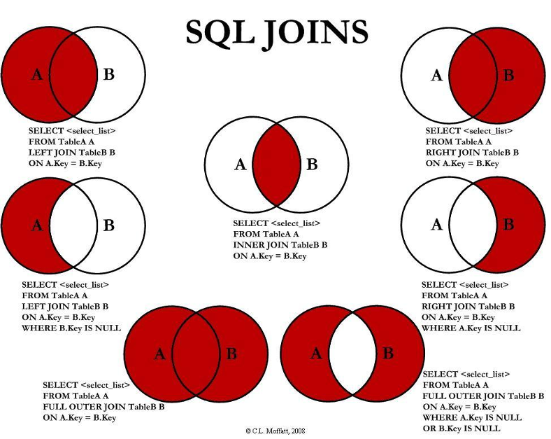

# SQL

## Tipos de datos en SQL

- **Boolean** (yes/1/true or no/0/false)
- **Character types → varchar(n)** ⇒ Cadena de caracteres de longitud variable.
- **Numeric types**
    - int ⇒ Números enteros.
    - smallint ⇒ Subconjunto dependiente de la máquina del tipo dominio entero.
    - numeric(p,d) ⇒ Número en coma fija, cuya precisión la especifica el usuario. El número está formado por p dígitos (más el signo) y de esos p, d pertenecen a la parte decimal.
    - float(n) ⇒ Número con decimales cuya precisión es definida por n.
- **Temporal types** ⇒ date, time, timestamp, interval.
- **UUID** ⇒ Universally Unique Identifiers.
- **Array** ⇒ array strings, numbers, etc.
- **JSON**

## Acceder al docker-compose postgres

```docker
docker-compose up -d

*localhost:5050 => web*
```

## Cláusulas SELECT/FROM

```sql
SELECT [ALL | DISTINCT] *columnas*
FROM *tabla*
WHERE condición
```

```sql
SELECT DISTINCT ColumnName FROM TableName; => muestra valores únicos en las columasn espeficadas, eliminando duplicados
```

La cláusula SELECT puede contener expresiones aritméticas que involucran la operación (+, -, *, /), y que funcionan en las constantes o en los atributos de las tuplas.

| **COUNT(*)** | Cuenta los elementos de un grupo. Se utiliza el * para no tener que indicar un nombre de columna concreto. |
| --- | --- |
| **SUM (ColumnName)** | Suma los valores de la expresión |
| **AVG (ColumnName)** | Media aritmética de la expresión |
| **MIN (ColumnName)** | Mínimo valor que toma la expresión |
| **MAX (ColumnName)** | Máximo valor que toma la expresión |
| **STDDEV (ColumnName)** | Calcula la desviación estándar |
| **VARIANCE (ColumnName)** | Calcula la varianza |
| **ROUND (valor [,n])** | Redondea el valor en n posiciones decimales. Si se omite n, usa 0 por defecto. n puede ser negativo, redondeando los números a la izquierda de la división de decimales. |
| **TRUNC (valor [,n])** | Trunca el valor en n posiciones decimales. |
| **MOD (m, n)** | Devuelve el resto de m dividido entre n |
| **CEIL (n)** | Devuelve el número entero más pequeño o que sea mayor o igual a n. |
| **FLOOR (n)** | Devuelve el número entero más alto que sea menos o igual a n. |

```sql
SELECT DISTINCT first_name FROM actor; -- nombres no repetidos
SELECT COUNT(DISTINCT first_name) FROM actor;
SELECT max(first_name) FROM actor; -- último de la lista (alfabéticamente)
```

## Alias y renombrado de columnas

```sql
SELECT column1 FROM table t *=> establecer un alias a la tabla*
SELECT column1 as column_name FROM table *=> renombrar la columna*

SELECT count(actor_id) as Total_Actores from actor 
```

> EJERCICIO 1: ¿Qué porcentaje supone el coste de alquiler sobre el coste de reemplazar? Ofrece un resultado redondeado a 2 decimales y renombra la columna.
> 

```sql
SELECT  title, rental_rate, replacement_cost, 
round(replacement_cost / rental_rate,2) as new_column
FROM film
```

> EJERCICIO 2: ¿Cuántas veces tienen que alquilar cada película para igualar o superar el coste de reemplazar la película? Da un resultado entero y renombra la nueva columna.
> 

```sql
SELECT title, rental_rate, replacement_cost, 
ceil(replacement_cost / rental_rate)
as breakeven from film
ORDER BY breakeven DESC 
```

## Cláusula WHERE

WHERE especifica las condiciones que debe satisfacer el resultado.

Los resultados de la comparación se pueden combinar utilizando las conectivas lógicas **and, or** y **not**. Las comparaciones se pueden aplicar a los resultados de las expresiones aritméticas. SQL incluye un operador de comparación **BETWEEN**.

```sql
WHERE columnName  BETWEEN numero_1 and numero_2;
WHERE columnName  > 2 and columnName < 6;
```

```sql
SELECT * FROM actor
WHERE first_name = 'Ed' or first_name = 'Nick';
```

*Ejemplo: todas las películas que cueste menos de 5€ alquilarlas.*

```sql
SELECT  title FROM public.film
WHERE rental_rate  < 5;
```

*Ejemplo: varias condiciones “and”*

```sql
SELECT * FROM film
where replacement_cost > 2 
and title ilike 'T%' 
-- and rental_duration > 2
and rental_duration BETWEEN 0 and 5
and release_year = 2006
and length > 100
and rental_rate > 2;
```

**Conjunto de condiciones**

```sql
WHERE columnName  in (string1, string2, string3 … 
stringN)
WHERE columnName  not in (string1, string2, string3 … 
stringN)
```

*Ejemplo: Todas las películas que (no) se titulen Titanic o Casablanca.*

```sql
WHERE columnName  in (“Titanic”, “Casablanca”)
WHERE columnName  not in (“Titanic”, “Casablanca”)
```

### LIKE: Operaciones con cadenas

El operador LIKE utiliza patrones que son descritos por los caracteres especiales.

- % → encaja con cualquier subcadena.
- _ → encaja con cualquier caracter.

```sql
SELECT * FROM actor
WHERE first_name LIKE 'N%' -- *empieza por N*
or first_name LIKE '%n'  -- *acaba por n*
or first_name LIKE '%n%'; -- *contiene n*

SELECT * FROM actor
**WHERE first_name ILIKE '%n%'; -- *ILIKE (no distingue mayus minus)*

```

### NULL

Operaciones valores nulos. Para detectar filas que están vacías.

```sql
SELECT * FROM actor
WHERE last_name is null
WHERE last_name is not null
```

## Cláusula ORDER BY

Orden descendiente (DESC) o ascendiente (ASC).

Se puede limitar la tabla de resultados que obtenemos al nº de filas que queramos (limit).

```sql
SELECT * FROM tablename
ORDER BY Column1, Column2 … ColumnN DESC|ASC
limit 10;
```

*Ejemplo: Haz un listado de las películas que tenemos disponibles en el videoclub en orden descendiente*

```sql
SELECT * FROM films
ORDER BY title DESC;
```

??

```sql
select special_features from film

select special_features[1] from film -- el primero de la "lista"
where replacement_cost >2;

select * from film
where special_features[2] ilike 'D%';

```

## Cláusula GROUP BY

> **Ejercicio 6:** obtén por “rating”
> 

```sql
-- Nº de películas
SELECT rating, count(*) FROM film
GROUP BY rating;
-- Precio medio de alquiler
SELECT rating, ROUND(AVG(rental_rate),2) FROM film
GROUP BY rating;
-- Mínimo precio de alquiler
SELECT rating, MIN(rental_rate) FROM film
GROUP BY rating;
-- Máximo precio de alquiler
SELECT rating, MAX(rental_rate) FROM film
GROUP BY rating;
-- Duración media de las películas
SELECT rating, AVG(length) FROM film
GROUP BY rating;
-- Año de la película más antigua
SELECT rating, MAX(release_year) FROM film
GROUP BY rating;
-- Año de la película más nueva
SELECT rating, MIN(release_year) FROM film
GROUP BY rating;

-- Todo en la misma tabla
SELECT rating, count(*), ROUND(AVG(rental_rate),2), MIN(rental_rate), MAX(rental_rate), AVG(length), MAX(release_year), MIN(release_year)
FROM film
GROUP BY rating;
```

### HAVING

Función de búsqueda y filtrado en operaciones GROUP BY. Filtra los grupos, funciona como el “WHERE”.

Solo  aparecen en el resultado de la consulta los grupos que cumplen las condiciones  HAVING. Solo puede aplicar una cláusula HAVING a las columnas que también  aparecen en la cláusula GROUP BY o en una función de agregado.

```sql
SELECT column1, column2, sum(column3), count(column4)
FROM table 
GROUP BY Column1, Column2 
HAVING count(column4) > 1

GROUP BY 1 = GROUP BY Column1 -- 1 = primera de SELECT
```

*Ejemplo*

```sql
SELECT editorial, count(*)
FROM libros
WHERE editorial<>'Planeta'
GROUP BY editorial;

-- es "igual" a:

SELECT editorial, count(*)
FROM libros
GROUP BY editorial
HAVING editorial<>'Planeta';
```

Estas dos maneras dan el mismo resultado, pero es más eficiente WHERE que HAVING ya que filtra primero y luego agrupa. Se recomienda filtrar primer con el WHERE y usar HAVING solo con condiciones relacionadas con los grupos.

> **Ejercicio 7:** Obtén por “rating”:
> 

```sql
-- Nº películas con rating que tengan más de 200 películas
SELECT rating, count(*), ROUND(AVG(rental_rate),2), MIN(rental_rate), MAX(rental_rate), ROUND(AVG(length),2), MAX(release_year), MIN(release_year)
FROM film
GROUP BY rating
HAVING count(*)>200;
-- Precio medio ded alquiler, solo con aquellos rating con precio > 3
SELECT rating, count(*), ROUND(AVG(rental_rate),2), MIN(rental_rate), MAX(rental_rate), ROUND(AVG(length),2), MAX(release_year), MIN(release_year)
FROM film
GROUP BY rating
HAVING ROUND(AVG(rental_rate),2) > 3;
-- Duración media, solo aquellos rating que tengan una duración media > 115 minutos
SELECT rating, count(*), ROUND(AVG(rental_rate),2), MIN(rental_rate), MAX(rental_rate), ROUND(AVG(length),2), MAX(release_year), MIN(release_year)
FROM film
GROUP BY rating
HAVING ROUND(AVG(length),2) > 115;
```

## Cláusula JOIN

Modelo relacional de base de datos: define la implementación lógica de la información del negocio mediante una serie de tablas, campos, restricciones, relaciones entre las mismas, etc. 

En el diseño de bases de datos relacionales, se llama clave primaria, llave primaria o clave principal a un campo o a una combinación de campos que identifica de forma única a cada fila de una tabla.



```sql
-- LEFT JOIN
 SELECT a.column1, b.column2
 FROM tableA a
 LEFT JOIN tableB b on a.column1 = b.column2
 LEFT JOIN tableC c on a.column1 = c.column2
  
-- RIGHT JOIN
SELECT a.column1, b.column2
FROM tableA a
RIGHT JOIN tableB b on a.column1 = b.column2
RIGHT JOIN tableC c on a.column1 = c.column2

-- INNER JOIN
SELECT a.column1, b.column2
FROM tableA a
INNER JOIN tableB b on a.column1 = b.column2
```

Buena práctica: utilizar alias en las tablas y columnas (tabla alias = film f)

*Ejemplo: film & language (language_id)*

```sql
-- LEFT: "predomina" film (A)
SELECT title, name FROM film
LEFT JOIN language on film.language_id = language.language_id;

-- RIGHT: "predomina" language (B) = salen todos los idiomas independientemente de si hay películas en ese idioma o no
SELECT title, name FROM film
RIGHT JOIN language on film.language_id = language.language_id;
```

*Ejemplo: relacionar 3 tablas*


```sql
-- Lístame todas las películas donde sale cada actor 
SELECT title, first_name, last_name
FROM film f
INNER JOIN film_actor fa on f.film_id = fa.film_id
INNER JOIN actor a on fa.actor_id = a.actor_id;

-- Conteo de las películas por actor
SELECT first_name, last_name, count(f.title) -- recomendable poner el alias en todas las columnas
FROM film f
INNER JOIN film_actor fa on f.film_id = fa.film_id
INNER JOIN actor a on fa.actor_id = a.actor_id
GROUP BY a.first_name, a.last_name
HAVING count(f.title) > 30

-- Conteo de actores por película
SELECT title, count(a.first_name)
FROM film f
INNER JOIN film_actor fa on f.film_id = fa.film_id
INNER JOIN actor a on fa.actor_id = a.actor_id
GROUP BY f.title
HAVING count(a.first_name) > 4;

/* Si no se pone alias, no hace falta ponerlo
SELECT title, count(first_name)
FROM film
INNER JOIN film_actor on film.film_id = film_actor.film_id
INNER JOIN actor on film_actor.actor_id = actor.actor_id
GROUP BY title
*/
```

> **Ejercicio 9:** Obtén solamente las películas que tienen un actor que tenga un apellido que empiece por C.
> 

```sql
SELECT TITLE, f.title, a.last_name
FROM film f
INNER JOIN film_actor fc ON fc.film_id = f.film_id
INNER JOIN actor a ON fc.actor_id = a.actor_id
WHERE a.last_name like ‘C%’

--  Cuántos actores tienen cada película
SELECT f.title, count(a.actor_id)
from film f
INNER JOIN film_actor fa on f.film_id = fa.film_id
INNER JOIN actor a on a.actor_id = fa.actor_id
GROUP BY f.title;

-- Cuáles son las películas que tienen más de 2 actores
SELECT f.title, count(a.actor_id)
from film f
INNER JOIN film_actor fa on f.film_id = fa.film_id
INNER JOIN actor a on a.actor_id = fa.actor_id
GROUP BY f.title
HAVING count(a.actor_id) > 2
ORDER BY count(a.actor_id) DESC;

-- Cuál es la película que tiene más actores
SELECT f.title, count(a.actor_id)
from film f
INNER JOIN film_actor fa on f.film_id = fa.film_id
INNER JOIN actor a on a.actor_id = fa.actor_id
GROUP BY f.title
ORDER BY COUNT(a.actor_id) DESC
limit 1;

```

## Cláusula CREATE TABLE

```sql
CREATE TABLE IF NOT EXISTS TableName (
column1 serial4 NOT NULL,
column2 varchar(50) NOT NULL,
column3 int2 NOT NULL,
column4 timestamp NOT NULL DEFAULT now(),
)
```

El tipo de dato en la columna no es siempre necesario.

“IF NOT EXISTS” es opcional.

> **Ejercicio 10:** Crear una tabla REVIEWS con estas columnas: film_id, customer_id, review_date, review_description
> 

```sql
CREATE TABLE IF NOT EXISTS reviews_twc (
film_id int2 NOT NULL,
customer_id int2 NOT NULL,
review_date date NOT NULL,
review_description varchar(50) NOT NULL
);

```

### INSERT

Inserción de registros en una tabla.

> **Ejercicio 11**
> 

```sql
INSERT INTO reviews_twc (
film_id, customer_id, review_date, review_description
)
VALUES (
'4',  '7','10-11-2023', 'La película es un poco aburrida'
);

```

### UPDATE

Actualización de registros de una tabla, bajo una condición.

> **Ejercicio 12:** cambiar la opinión del cliente 7.
> 

```sql
UPDATE reviews_twc
SET review_description = 'La película es bastante divertida'
WHERE customer_id = 7 and film_id = 4;
```

SET indica el nuevo valor. WHERE ayuda a identificar qué fila es.

### DROP TABLE

Elimina una tabla existente en una base de datos, junto con todos sus datos y su estructura. Es irreversible.

```sql
DROP TABLE Esquema.TableName;
```

### DELETE

Borrar registros de una tabla, bajo condición.

> **Ejercicio 13:** Borrar la opinión.
> 

```sql
DELETE FROM reviews_twc
WHERE customer_id = 7;
```

## ALTER TABLE

Se utiliza para modificar  una tabla sin tener que crear una nueva.

```sql
 ALTER TABLE table_name [action];
```

- Drop a column

```sql
ALTER TABLE table_name 
DROP COLUMN column_name;
```

- Rename a column

```sql
ALTER TABLE table_name 
RENAME COLUMN column_name TO new_column_name;
```

- Change the data type of a column

```sql
ALTER TABLE film 
ALTER COLUMN location TYPE VARCHAR,
ALTER COLUMN description TYPE VARCHAR;
```

- Rename a table

```sql
ALTER TABLE table_name
RENAME TO new_table_name;

ALTER TABLE IF EXISTS table_name
RENAME TO new_table_name;
```

- Add a column

```sql
ALTER TABLE table_name
ADD COLUMN new_column varchar;
```

> **Ejercicio 13**
> 

```sql
/* Añade una nueva columna a la tabla de reviews que te parezca interesante. 
Por ejemplo, el número de estrellas que le darías a una película. 
Puedes llamarle “review_stars” y con datatype int2.  */
ALTER TABLE reviews_twc
ADD COLUMN review_stars INT;

/* Renombra una de las columnas de la tabla de reviews. 
Por ejemplo, renombra la columna “review_description” a “review_opinion”*/
ALTER TABLE reviews_twc
RENAME COLUMN review_description to review_opinion;

/* Cambia el tipo de dato de la columna de “review_stars” a varchar. 
Ahora es in int2.*/
ALTER TABLE reviews_twc
ALTER COLUMN review_stars TYPE VARCHAR;

/*Borra la columna de “review_stars*/
ALTER TABLE reviews_twc
DROP COLUMN review_stars;
```

*Extra [ARRAY_AGG]: para que te salga la lista de nombres de actores en lugar de solo el número*

```sql
SELECT title, ARRAY_AGG (first_name || ' '|| last_name) actors
FROM film f
INNER JOIN film_actor fa on f.film_id = fa.film_id
INNER JOIN actor a on a.actor_id = fa.actor_id
GROUP BY f.film_id;
```

## VIEWS

Tabla virtual en una base de datos SQL que se crea a partir de una consulta SQL. Se pueden utilizar para guardar consultas completas que se utilizan con frecuencia. 

Las vistas pueden simplificar consultas complicadas. En lugar de escribir consultas largas y complejas cada vez, puedes crear una vista y luego consultar la vista como si fuera una tabla.

Permiten a los desarrolladores y usuarios trabajar con una versión simplificada de los datos sin preocuparse por la estructura subyacente de las tablas. Puedes reutilizar consultas SQL complejas en varias partes de una aplicación sin necesidad de duplicar código.

```sql
CREATE VIEW NameView AS
[QUERY];

SELECT * FROM NameView;
```

> **Ejercicio 14:** Crear VIEWS donde las *queries* sean los 3 mejores clientes y los 3 peores.
> 

```sql
CREATE VIEW best_customers AS
SELECT c.first_name, c.last_name, SUM(p.amount) 
FROM customer c
INNER JOIN payment p ON c.customer_id = p.customer_id
GROUP BY c.first_name, c.last_name
ORDER BY SUM(p.amount) DESC
LIMIT 3;
-- SELECT * FROM best_customers;

CREATE VIEW worst_customers AS
SELECT c.first_name, c.last_name, SUM(p.amount) 
FROM customer c
INNER JOIN payment p ON c.customer_id = p.customer_id
GROUP BY c.first_name, c.last_name
ORDER BY SUM(p.amount) ASC
LIMIT 3;
-- SELECT * FROM worst_customers;
```

### UNION

Hacer una query de dos vistas para que salgan juntas en una misma tabla.

```sql
SELECT * FROM best_customers b
UNION
SELECT * FROM worst_customers b;
```

Se podría hacer una vista de esta query.

Se recomienda no hacer tantas vistas de vistas ya que dificulta la trazabilidad.

## SUBCONSULTAS

Es una consulta dentro de una consulta. Se utiliza para realizar operaciones complejas en varios pasos, donde el resultado de la subconsulta se usa como entrada para la consulta externa.

1. **WHERE:** Filtrar resultados basados en el resultado de otra consulta.

```sql
SELECT actor_id, first_name, last_name
FROM actor
where first_name in (select first_name from 
actor where last_name ilike 'C%');
```

*Ejemplo: Obtén haciendo una subconsulta en la cláusula WHERE, todas aquellas películas que están en el idioma de inglés.*

```sql
SELECT film_id, title, description, language_id
FROM film
WHERE language_id in (
	SELECT language_id 
	FROM language 
	WHERE name = 'English' );
```

*Ejemplo: Obtén haciendo una subconsulta en la cláusula WHERE, todos aquellos clientes que viven en una dirección que empieza por A.*

```sql
SELECT customer_id, first_name, last_name, address_id
FROM customer
WHERE address_id IN (
	SELECT address_id FROM address
	WHERE address ILIKE 'A%')
```

Ejemplo: Obtén haciendo una subconsulta en la cláusula WHERE, aquellos clientes que han se han gastado más de 190€.

```sql
SELECT customer_id, first_name, last_name, address_id
FROM customer
WHERE customer_id IN (
    SELECT customer_id 
    FROM payment
    GROUP BY customer_id
    HAVING SUM(amount) > 190
);
```

1. **WITH:** Es una subconsulta temporal que puedes definir al inicio de una consulta SQL para mejorar la legibilidad y la organización de consultas complejas.

**Entre la subconsulta WITH y el SELECT, no se pone ;

```sql
WITH my_sub_query AS (
SELECT title, rental_rate, replacement_cost, 
round(replacement_cost / rental_rate, 2) 
as ratio FROM film
)
SELECT * FROM my_sub_query WHERE ratio > 3;

-- ES LO MISMO QUE

SELECT title, rental_rate, replacement_cost, 
round(replacement_cost / rental_rate, 2) as ratio
WHERE round(replacement_cost / rental_rate, 2) > 3
```

*Ejemplo: La suma de los amount que de los clientes que han pagado más de 190€*

```sql
WITH my_query as (SELECT customer_id, SUM(amount) as total_amount
FROM payment
GROUP BY customer_id)
SELECT * from my_query WHERE total_amount > 190;
```

*Ejemplo: El número de clientes que han pagado más de 190€*

```sql
WITH query_2 as (SELECT customer_id, SUM(amount) AS total_amount
FROM payment
GROUP BY customer_id)
SELECT count(customer_id), SUM(total_amount) FROM query_2 
WHERE total_amount > 190;
```

1. **FROM:** Se trata como una tabla temporal, permitiendo usar su resultado como si fuera una tabla en la consulta principal.

```sql
SELECT SUM(total_amount), COUNT(customer_id)
FROM (
	SELECT customer, SUM(total_amount) AS total_amount
	FROM payment p
	GROUP BY 1
	HAVING SUM(amount) > 190
	)
```

## PYTHON

```python
# Módulo para usar PostgresSQL desde python
import pycopg2
# Establecer una conexión: connecta a la base de datos
conn_target = psycopg2.connect(
        host=host,
        database=database,
        user=user,
        password=password,
        port=port
        )
# Crear un cursor. Un cursor se utiliza para ejecutar comandos SQL y recuperar resultados de consultas.
cur_target = conn_target.cursor()
# Ejecutar una consulta
cur_target.execute("""SELECT * FROM PUBLIC.FILM""")
# Obtener los resultados por consola
rows = cur_target.fetchall()
for row in rows:
    print(row)
    
# Cerrar el cursor y la conexión    
cur_target.close()
conn_target.close()
```